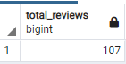
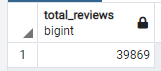
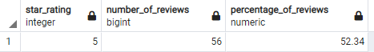

# Amazon_Vine_Analysis

## Resources 

Amazon Web Services, Google Collab Notebook, PySpark 3.0.2, pgAdmin 4.29

## Overview

The purpose of this project was to analyize data on Amazon reviews to determine if reviewers who participate in the paid Vine program are more likely to give favorable reviews to products than reviewers who are not paid by this program.  

In order to perform the analysis for this project, I first extracted a dataset of Amazon reviews for outdoor products from an S3 AWS bucket, transform the data set into multiple tables to match a given database schema using PySpark, and load the tables into an Postgres Database hosted on an AWS server.  

Then, I queried the tables in the database to perform the analysis.  I found the total number of where a majority of users found the review useful.  I then filtered separated those reviews into tables for reviews that were part of the paid Vine program and reviews that weren't.

For each of those groups, I then calculated the total number of reviews, the total number of 5-star reviews, and the percentage of reviews that were 5 stars, in order to determine if reviews in the Vine program were more or less likely to be given 5-stars than reviews that were not part of the program.

## Results

- There were 107 reviews written as part of the paid Vine program, as seen from the query output here:

And there were 39,869 reviews written that were not part of the paid program:

- Of the paid reviews, 56 were given 5 stars:

And Of the unpaid reviews, 21,005 were given 5 stars:

- As seen above, 52.34 % of paid reviews were 5 stars, and 52.69 % of unpaid reviews were 5 stars.

## Summary

The likelihood that a product will be given a 5 star review is almost identical for paid and unpaid reviewers, as can be seen by the percentages of 5 star reviews for the two groups being so close.  There is therefore no inherent bias on the part of paid reviewers to give a good review.

Additional analysis could be done to support this conclusion by determining the percentage of the total number of reviews that are paid and the percentage that are unpaid, then calculating the percentage of all 5 star reviews that were paid and the percentage that were unpaid, and then comparing those two sets.  If the proportion of paid vs unpaid reviews for the total is similar to the proportion of paid vs unpaid for 5-star reviews, this would demonstrate that being paid did not increase or decrease the likelihood of getting a 5-star review.

